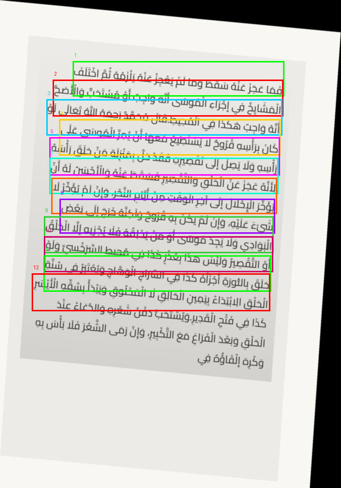
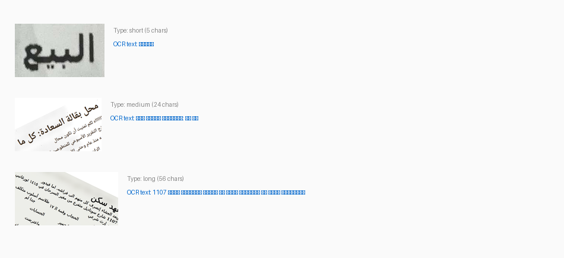

# AutoTrainer 数据格式指南

> 支持的数据格式完整说明，包含检测和识别两种任务的示例。

---

## 一、检测任务 (Object Detection)

用于文本区域检测训练。每张完整文档图片标注多个文本框坐标。

### 图片示例



*上图：阿拉伯语文档截图的检测标注，每个彩色框是一个文本区域，坐标为 [x1, y1, x2, y2]*

### JSONL 数据格式

```jsonl
{"image_name": "img_00000006.png", "source": "qari-arabic-ocr-10k", "image_path": "/path/to/img_00000006.png", "bboxes": [[46, 45, 427, 128], [213, 140, 640, 185], [47, 246, 438, 411], [51, 471, 502, 658], [232, 704, 524, 762], [203, 864, 530, 1000], [200, 907, 427, 1000], [48, 922, 153, 998]], "num_boxes": 15}
```

### 坐标说明

每条记录的 `bboxes` 是一个列表，每个元素为 `[x1, y1, x2, y2]`：

```
   (x1, y1) ───────────┐
   │                    │
   │   文本区域          │
   │                    │
   └─────────── (x2, y2)
```

- `x1, y1`: 文本框**左上角**坐标（像素）
- `x2, y2`: 文本框**右下角**坐标（像素）
- 坐标原点在图片**左上角**

---

## 二、识别任务 (Text Recognition)

用于文本行识别训练。每张图片是一行裁剪好的文字。

### 图片示例



*从上到下：短文本（10字符）、中文本（24字符）、长文本（56字符）*

### JSONL 数据格式 (messages, 用于 VL-SFT 训练)

```jsonl
{"messages": [{"role": "user", "content": "<image>OCR:"}, {"role": "assistant", "content": "بطاقة عودة"}], "images": ["/path/to/crop_00007380_12579.png"]}
{"messages": [{"role": "user", "content": "<image>OCR:"}, {"role": "assistant", "content": "محل بقالة السعادة: كل ما"}], "images": ["/path/to/crop_00008055_20151.png"]}
{"messages": [{"role": "user", "content": "<image>OCR:"}, {"role": "assistant", "content": "1107 شارع سوناديل متفرع من مغير السرحان في ١٤١٥ ثورغانبي"}], "images": ["/path/to/crop_00001460_16330.png"]}
```

### 格式说明

| 字段 | 说明 |
|------|------|
| `messages` | 对话格式，`<image>` 是图片占位符，user 的 `OCR:` 是任务提示 |
| `images` | 图片文件绝对路径列表，顺序对应 messages 中的 `<image>` 占位符 |
| `assistant` 的 `content` | **OCR 识别结果**，即图片中的文字内容 |

### 展开后的可读示例

```json
{
  "messages": [
    {
      "role": "user",
      "content": "<image>OCR:"
    },
    {
      "role": "assistant", 
      "content": "1107 شارع سوناديل متفرع من مغير السرحان في ١٤١٥ ثورغانبي"
    }
  ],
  "images": [
    "/data/lizhijun/work/PaddleFormersAutomatedTraining/ocr_training_data/synthesis_100k/rec_crops/crop_00001460_16330.png"
  ]
}
```

---

## 三、数据转换命令

AutoTrainer 的 DataAgent 可以自动将任意格式转换为上述标准格式：

```bash
# 单个文件转换
autotrainer data --path /data/my_dataset.csv --output-dir ./output

# 整个目录（支持嵌套）
autotrainer data --path /data/ocr_datasets/ --output-dir ./output

# 仅查看数据画像（不转换）
autotrainer data --path /data/cleaned.jsonl --profile-only

# 仅切分训练/验证集
autotrainer data --path /data/cleaned.jsonl --split-only
```

支持的输入格式：JSONL, JSON, CSV, TSV, Parquet, XML, ZIP, 目录（任意嵌套）。

---

## 四、完整 Pipeline 示例

```bash
# Step 1: 数据准备（自动转换、清洗、切分）
autotrainer data --path ./raw_images_and_labels/ --output-dir ./training_data

# Step 2: 一键训练（自动消融 + 全量训练）
autotrainer train --data-dir ./training_data --gpus 4,5,6,7

# Step 3: 查看报告
autotrainer report --format html
```
